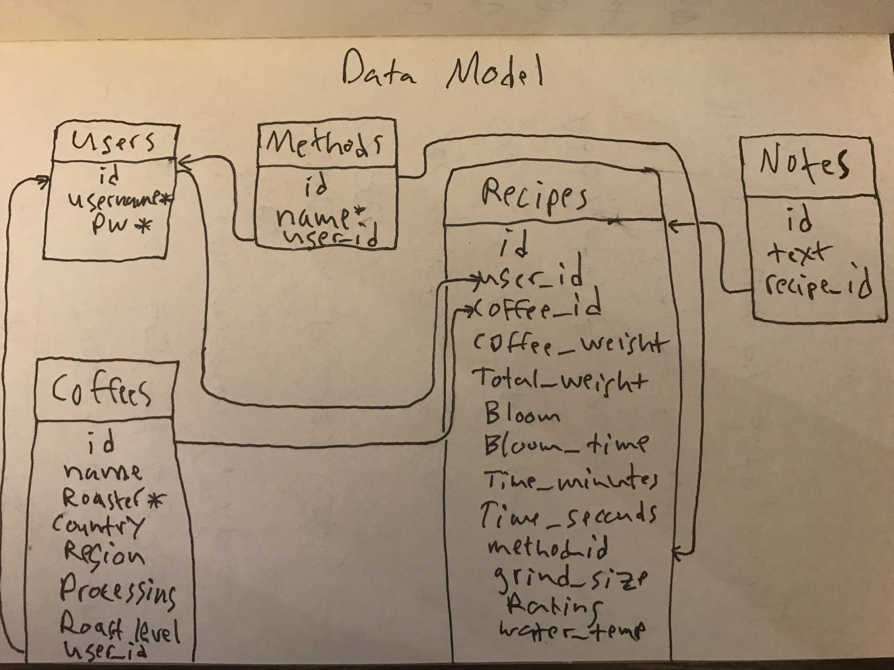

<h1 align="center">
    Data Model
</h1>

The data model for this application has five entities: Users, Coffees, Methods, Recipes, Notes  

The relationships are as follows:
* A User can have many Recipes
* A User can have many Coffees
* A User can have many Methods
* A Recipe can have many Notes
* A Recipe has one Coffee
* A Recipe has one Method

Here is a draft of the data model design showing links between the tables. Note, some fields may have been added or updated since this draft was made, but the relationships are the same.  
  

## Tables

### Users

| Field | Data Type | Default | Description |
|---|---|---|---|
| id | integer | system assigned id number | Primary key. Not Nullable. Unique. |
| username | String | None | 255 character max. Not Nullable. Unique |
| password | String | None | 255 character max. Not Nullable. |

### Coffees

| Field | Data Type | Default | Description |
|---|---|---|---|
| id | integer | system assigned id number | Primary key. Not Nullable. Unique. |
| name | String | Null | 255 character max. |
| roaster | String | None | 255 character max. Not Nullable. |
| country_of_origin | String | Null | 255 character max. |
| region | String | Null | 255 character max. |
| processing_method | String | Null | 255 character max. |
| roast_level | String | Null | 255 character max. |
| user_id | Integer | None | References `id` in Users table. Unsigned. On Delete: CASCADE. On Update: CASCADE |

### Methods

| Field | Data Type | Default | Description |
|---|---|---|---|
| id | integer | system assigned id number | Primary key. Not Nullable. Unique. |
| name | String | None | 255 character max. Not Nullable. |
| user_id | Integer | None | References `id` in Users table. Unsigned. On Delete: CASCADE. On Update: CASCADE |

### Recipes

| Field | Data Type | Default | Description |
|---|---|---|---|
| id | integer | system assigned id number | Primary key. Not Nullable. Unique. |
| name | String | None | 255 character max. Not Nullable. |
| coffee_weight | Float | None | Nullable. |
| total_weight | Float | None | Nullable. |
| bloom | Integer | None | Nullable. |
| bloom_time | Integer | None | Nullable. |
| bloom_weight | Integer | None | Nullable. |
| time_minutes | Integer | None | Nullable. |
| time_seconds | Integer | None | Nullable. |
| grind_size | String | None | 255 character max. Nullable. |
| rating | Integer | None | Nullable. |
| water_temp | Float | None | Nullable. |
| user_id | Integer | None | References `id` in Users table. Unsigned. On Delete: CASCADE. On Update: CASCADE |
| coffee_id | Integer | None | References `id` in Coffees table. Unsigned. On Delete: RESTRICT. On Update: CASCADE |
| method_id | Integer | None | References `id` in Methods table. Unsigned. On Delete: RESTRICT. On Update: CASCADE |

### Notes

| Field | Data Type | Default | Description |
|---|---|---|---|
| id | integer | system assigned id number | Primary key. Not Nullable. Unique. |
| text | String | Null | 2000 character max. |
| recipe_id | Integer | None | References `id` in Recipes table. Unsigned. On Delete: CASCADE. On Update: CASCADE |
